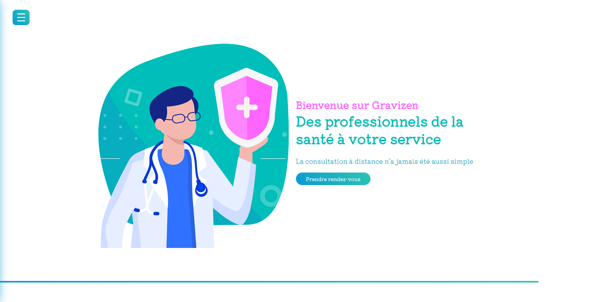
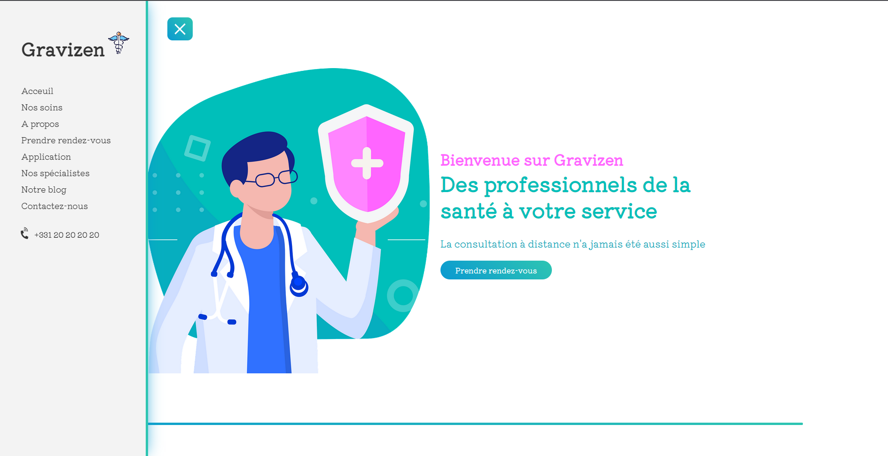
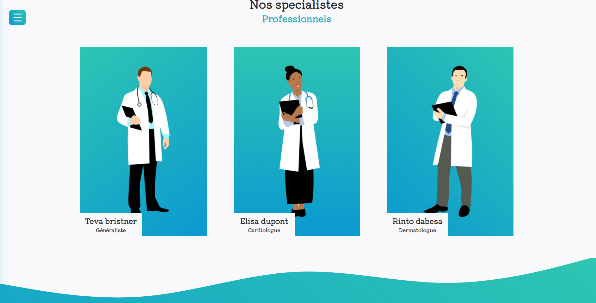

# COVID - WEBSITE - GRAVIZEN

This is a personal project carried out in the evening on my free time to improve my CSS skills. This project was developed by Alexandre Marolleau.

## Project overview

The HTML was already present in the code the principle being with the images provided in the file to simply make the whole website in CSS without touching the HTML.

### 1. Header

### 2. Navigation

### 3. Overview

### 4. Doctor section

